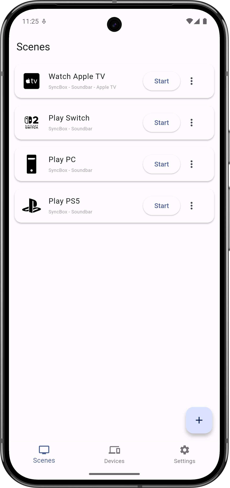
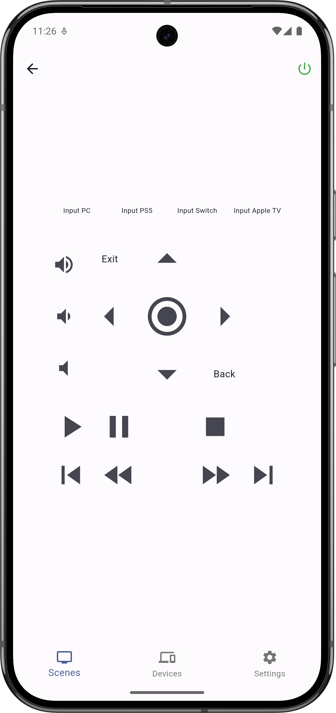
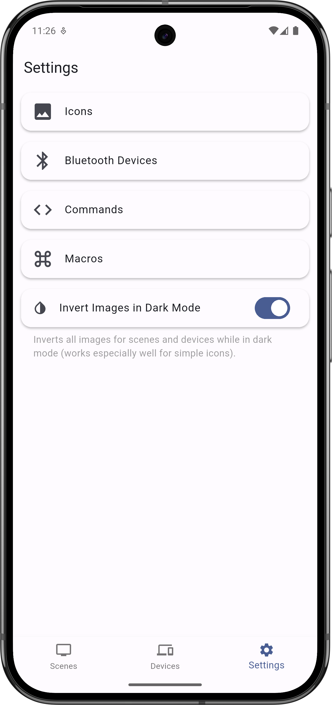

# Equilibrium Flutter App

This is a Flutter based client for the API of [Equilibrium](https://github.com/LeoKlaus/Equilibrium), an open source universal remote control.
If you don't know about Equilibrium, I recommend [taking a look at that project first](https://github.com/LeoKlaus/Equilibrium), as this app can only be used with an Equilibrium hub.

Currently, I'm only testing this on Android and Chrome/Safari but building for Windows and Linux should be possible without (major) modifications.
If you're looking for an iOS app, I suggest using [Equilibrium-iOS](https://github.com/LeoKlaus/Equilibrium-iOS), but you may also try build the Flutter app if you hate native apps.

## Contributing

This is my first time using Flutter so expect mediocre code quality at best. If you'd like to contribute a feature, please fork this repo and create a PR.

#### Builds
To build the android app, use
``` bash
flutter build apk --split-per-abi --no-tree-shake-icons
```
for the WebUI
``` bash
flutter build web --wasm --base-href "/ui/" --no-tree-shake-icons
```

## Installation

The web version of this will be bundled with future releases of Equilibrium, an Android APK is available in the [releases](https://github.com/LeoKlaus/Equilibrium-Flutter/releases) section.

## Known Issues

- The scene and device control screens may overflow on small screens
- Many errors are not handled

## Screenshots



